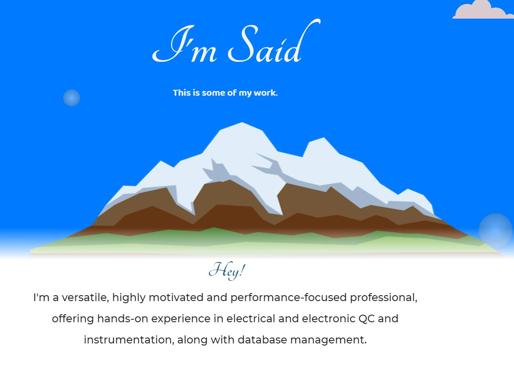

<!-- PROJECT TITE -->
  <h1 align="center">My Portfolio</h1>
  
  <!-- DESCRIPTION -->
  

  You are in the right place to know more about my work!.

  <!-- DEPLOYED LINK -->
  LivePage: https://saidhadad.github.io/Portfolio/
   
  GitHub repository URL: https://github.com/SaidHadad/Portfolio

  <!-- TABLE OF CONTENTS -->
  

  
Table of Contents

  <ol>
  <li><a href="#about-the-project">About The Project</a></li>
  <li><a href="#built-with">Built With</a></li>
  <!-- <li>
    <a href="#getting-started">Getting Started</a>
    <ul>
    <li><a href="#prerequisites">Prerequisites</a></li>
    <li><a href="#installation">Installation</a></li>
    </ul>
  </li> -->
  <li><a href="#contributing">Contributing</a></li>
  <li><a href="#license">License</a></li>
  <li><a href="#contact">Contact</a></li>
  </ol>
  

  
  
  <!-- ABOUT THE PROJECT -->
  ## About The Project

    
  Preview of my live page
  
  ## Built With

  * HTML
  * CSS
  * Bootrstap
  
  <!-- GETTING STARTED -->
  
  <!-- ## Getting Started

  ### Prerequisites

  ### Installation -->

  <!-- CONTRIBUTING -->
    
  <!-- LICENSE -->
  
  ## License

 

[MIT License](https://choosealicense.com/licenses/mit/)  
  
  <!-- CONTACT -->
  
  ## Contact
  Name: Said David Hadad  
  Email: saiddavid.hadad@gmail.com  
  GIT: https://github.com/SaidHadad  